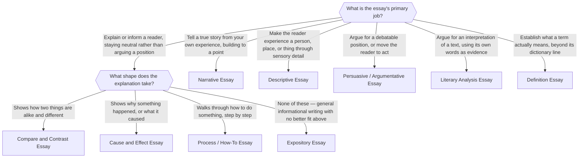

# Which Essay Type Do I Need?

> **At a glance.** Answer what the essay's primary job is, and — for expository writing —
> what shape the explanation takes. That narrows straight to one essay type and its
> [components](./components.md). Walk it top to bottom; each question has one right branch
> for a given essay, not several.

## What is the essay's primary job?

- **Tell a true story from your own experience, building to a point** → [Narrative Essay](./narrative.md)
- **Make the reader experience a person, place, or thing through sensory detail** → [Descriptive Essay](./descriptive.md)
- **Explain or inform a reader, staying neutral rather than arguing a position** → see *What shape does the explanation take?*, below
- **Argue for a debatable position, or move the reader to act** → [Persuasive / Argumentative Essay](./persuasive.md)
- **Argue for an interpretation of a text, using its own words as evidence** → [Literary Analysis Essay](./literary-analysis.md)
- **Establish what a term actually means, beyond its dictionary line** → [Definition Essay](./definition.md)

## What shape does the explanation take?

- **Shows how two things are alike and different** → [Compare and Contrast Essay](./compare-contrast.md)
- **Shows why something happened, or what it caused** → [Cause and Effect Essay](./cause-effect.md)
- **Walks through how to do something, step by step** → [Process / How-To Essay](./process.md)
- **None of these — general informational writing with no better fit above** → [Expository Essay](./expository.md)
